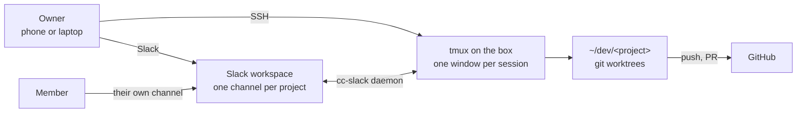
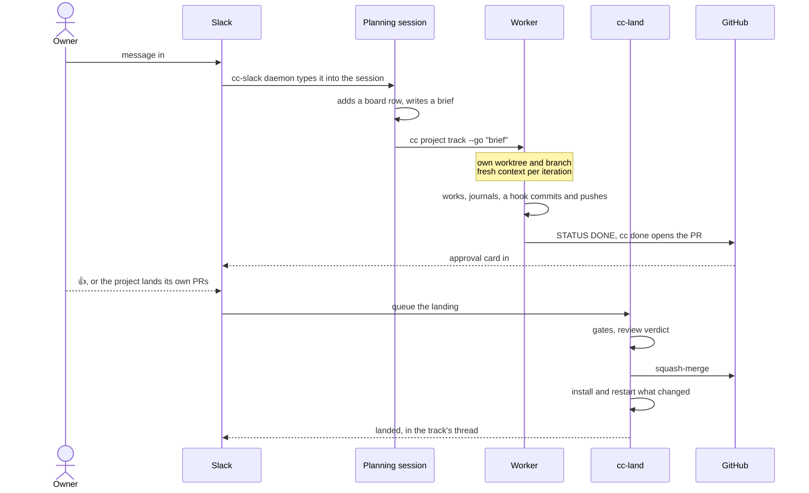
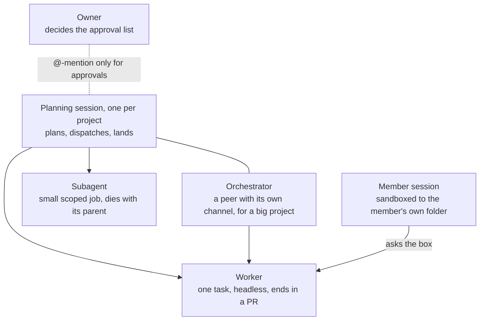
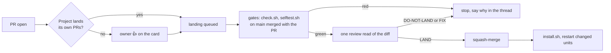
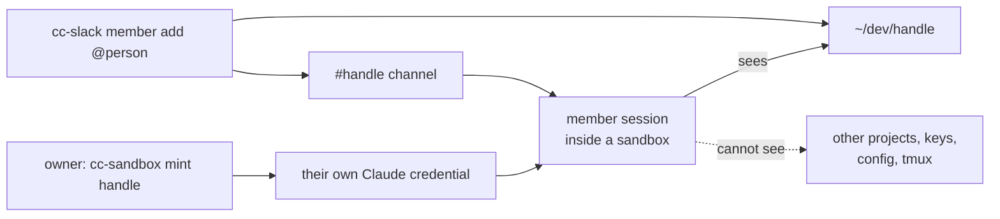

# A five-minute tour

For a person meeting the box for the first time. The detail is in [DESIGN.md](DESIGN.md) and [WORKING.md](WORKING.md).
Each diagram is also a PNG for slides, in [tour/](tour/).

## What it is

One always-on Linux machine with no screen. It runs Claude Code sessions in one tmux, and the owner drives them from
Slack on a phone or from SSH on a laptop. Each project in `~/dev` gets its own Slack channel and its own planning
session. The code that runs all this is plain shell and Python scripts; the thinking is Claude.

Three ideas carry the design:

- **Scripts keep the books, Claude thinks.** Worktrees, commits, pushes, PRs, the board and notices are scripts. No
  agent sits in the middle managing the others.
- **One task, one worktree.** Every piece of work gets its own git branch and folder, so two workers never write over
  each other.
- **State lives in files.** Journals, the board, git and PRs hold the state. A session can die at any moment and the
  next one reads where it got to.

## The life of one request

The owner types "add a health check to the dashboard" in the project's channel. This is what happens.

A small job can skip the worker: the planning session does it itself, or hands it to a subagent. Either way it ends
as a PR.

## Who does what

Sessions decide and act on their own. The owner is asked only for a short list, written in `~/CLAUDE.md`: deploys,
spend over budget, host and network changes, anything destructive, anything sent outward in the owner's name, and anything
that opens the box to the outside. A hook (`cc-guard`) enforces the list, so an agent cannot talk its way past it.

## How work is gated and landed

Nothing merges by hand. `cc-land` is the only thing that merges.

A gate result is recorded against the tree it ran on, so a tree that already passed is not tested twice. Commits and
the public mirror both refuse anything that names the private box.

## How a member gets a workspace

A member is a person the owner adds who is not the owner. They get a channel and a folder, and nothing else of the box.

A member session can start work only by asking the box, and it has a daily spend cap.

## Where to go next

- [DESIGN.md](DESIGN.md): why each piece is shaped the way it is.
- [WORKING.md](WORKING.md): what a session does between tasks.
- [../README.md](../README.md): installing it on a blank box.
